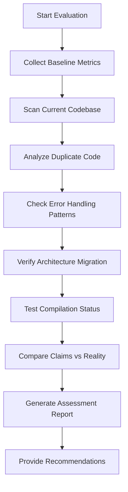

# Design Document

## Overview

This design outlines a comprehensive evaluation system to assess the true completion status of the GitAI project's refactoring efforts. The evaluation will use automated analysis tools, code metrics, and systematic verification to provide an evidence-based assessment of whether the claimed improvements have actually been implemented.

## Architecture

### Evaluation Framework

The evaluation system consists of four main components:

1. **Code Analysis Engine**: Automated scanning and metrics collection
2. **Comparison Module**: Baseline vs current state analysis  
3. **Verification System**: Claim validation against actual implementation
4. **Reporting Generator**: Comprehensive findings documentation

### Analysis Workflow



## Components and Interfaces

### 1. Code Analysis Engine

**Purpose**: Systematically scan the codebase to collect objective metrics

**Key Functions**:
- File duplication detection using content hashing
- Error handling pattern analysis via regex and AST parsing
- Architecture structure mapping
- Compilation warning collection
- Test execution status monitoring

**Interface**:
```rust
trait CodeAnalyzer {
    fn scan_duplicates(&self) -> Vec<DuplicateFile>;
    fn analyze_error_patterns(&self) -> ErrorPatternReport;
    fn map_architecture(&self) -> ArchitectureMap;
    fn collect_warnings(&self) -> Vec<CompilationWarning>;
}
```

### 2. Comparison Module

**Purpose**: Compare current state against claimed improvements and baseline metrics

**Key Functions**:
- Baseline metric loading from diagnostic reports
- Current state measurement
- Gap analysis between claims and reality
- Progress percentage calculation

**Interface**:
```rust
trait ComparisonEngine {
    fn load_baseline(&self, report_path: &str) -> BaselineMetrics;
    fn measure_current_state(&self) -> CurrentMetrics;
    fn calculate_gaps(&self, baseline: &BaselineMetrics, current: &CurrentMetrics) -> GapAnalysis;
}
```

### 3. Verification System

**Purpose**: Validate specific claims made in status reports against actual implementation

**Key Functions**:
- Claim extraction from status documents
- Evidence collection for each claim
- Verification result scoring
- False positive/negative detection

**Interface**:
```rust
trait ClaimVerifier {
    fn extract_claims(&self, document: &str) -> Vec<Claim>;
    fn verify_claim(&self, claim: &Claim) -> VerificationResult;
    fn score_accuracy(&self, results: &[VerificationResult]) -> AccuracyScore;
}
```

### 4. Reporting Generator

**Purpose**: Generate comprehensive, actionable reports with evidence-based findings

**Key Functions**:
- Structured report generation
- Evidence documentation
- Recommendation prioritization
- Action item creation

## Data Models

### DuplicateFile
```rust
struct DuplicateFile {
    original_path: String,
    duplicate_paths: Vec<String>,
    content_hash: String,
    similarity_score: f64,
}
```

### ErrorPatternReport
```rust
struct ErrorPatternReport {
    box_dyn_error_count: usize,
    unified_error_count: usize,
    inconsistent_patterns: Vec<InconsistentPattern>,
    migration_progress: f64,
}
```

### ArchitectureMap
```rust
struct ArchitectureMap {
    src_modules: Vec<ModuleInfo>,
    crate_modules: Vec<ModuleInfo>,
    cross_references: Vec<CrossReference>,
    migration_status: MigrationStatus,
}
```

### GapAnalysis
```rust
struct GapAnalysis {
    claimed_completion: f64,
    actual_completion: f64,
    gap_percentage: f64,
    specific_gaps: Vec<SpecificGap>,
}
```

## Error Handling

### Error Categories

1. **Analysis Errors**: Issues during code scanning or metric collection
2. **Verification Errors**: Problems validating claims against implementation
3. **Reporting Errors**: Failures in report generation or formatting
4. **System Errors**: File system, permission, or tool availability issues

### Error Recovery Strategy

- Graceful degradation: Continue evaluation even if some checks fail
- Partial results: Report findings for successful analyses
- Error documentation: Include analysis limitations in final report
- Retry mechanisms: Attempt failed operations with different approaches

## Testing Strategy

### Unit Testing
- Test each analyzer component independently
- Mock file system interactions for consistent testing
- Verify metric calculation accuracy
- Test error handling paths

### Integration Testing
- End-to-end evaluation workflow testing
- Real codebase analysis validation
- Report generation verification
- Cross-platform compatibility testing

### Validation Testing
- Compare results against manual code review
- Verify accuracy of duplicate detection
- Test claim verification against known true/false cases
- Benchmark performance on large codebases

## Implementation Approach

### Phase 1: Core Analysis Tools
1. Implement file duplicate detection using content hashing
2. Create error pattern analysis using regex and grep
3. Build architecture mapping through file system traversal
4. Develop compilation warning collection

### Phase 2: Verification Engine
1. Implement claim extraction from markdown documents
2. Create evidence collection mechanisms
3. Build verification logic for common claim types
4. Develop accuracy scoring algorithms

### Phase 3: Reporting System
1. Design structured report templates
2. Implement evidence documentation
3. Create recommendation generation logic
4. Build actionable next steps formatting

### Phase 4: Integration and Validation
1. Integrate all components into cohesive system
2. Test against GitAI codebase
3. Validate findings against manual review
4. Refine accuracy and completeness

## Performance Considerations

- **Caching**: Cache file hashes and analysis results to avoid redundant work
- **Parallel Processing**: Analyze multiple files concurrently where possible
- **Memory Management**: Stream large files rather than loading entirely into memory
- **Progress Reporting**: Provide feedback during long-running analyses

## Security Considerations

- **File Access**: Validate file paths to prevent directory traversal
- **Command Execution**: Sanitize inputs to compilation and analysis tools
- **Data Privacy**: Avoid logging sensitive code content in reports
- **Resource Limits**: Prevent excessive resource consumption during analysis