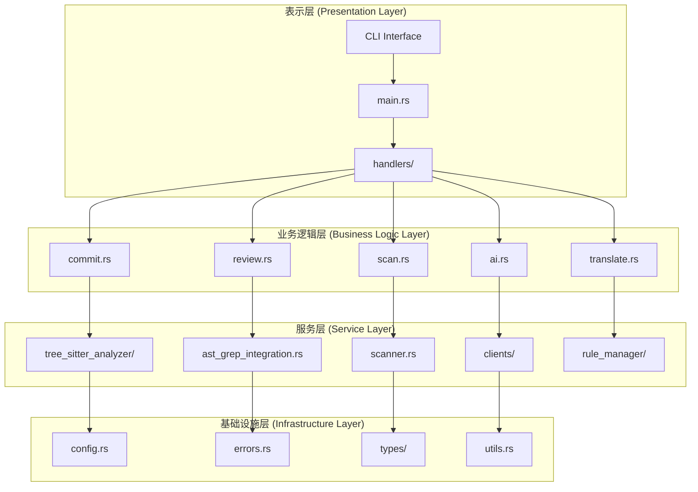
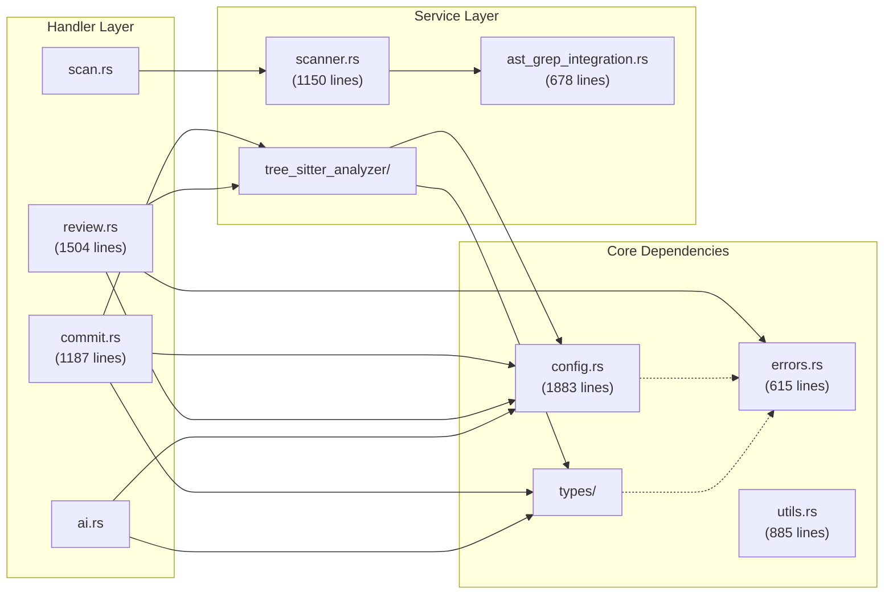
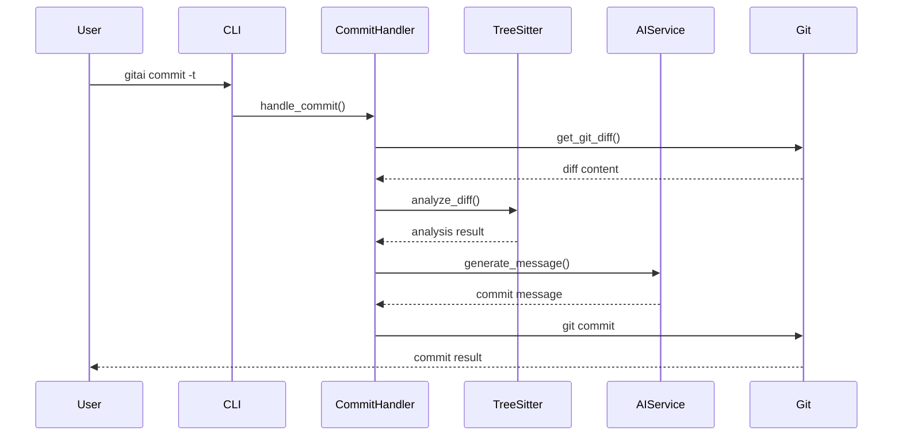
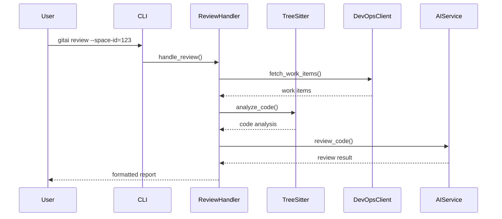
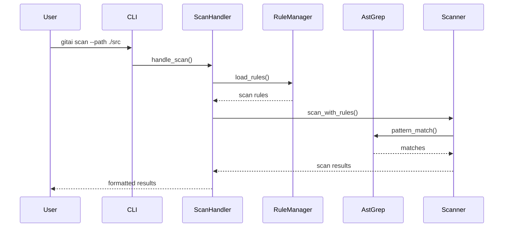
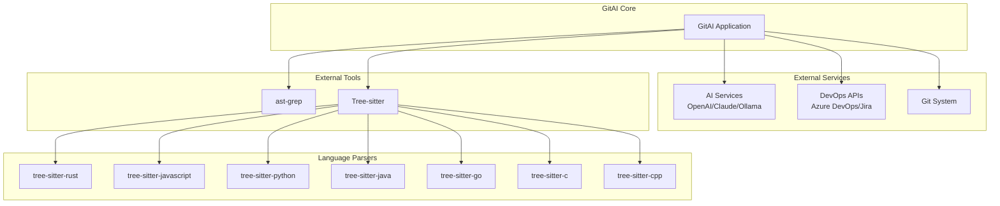
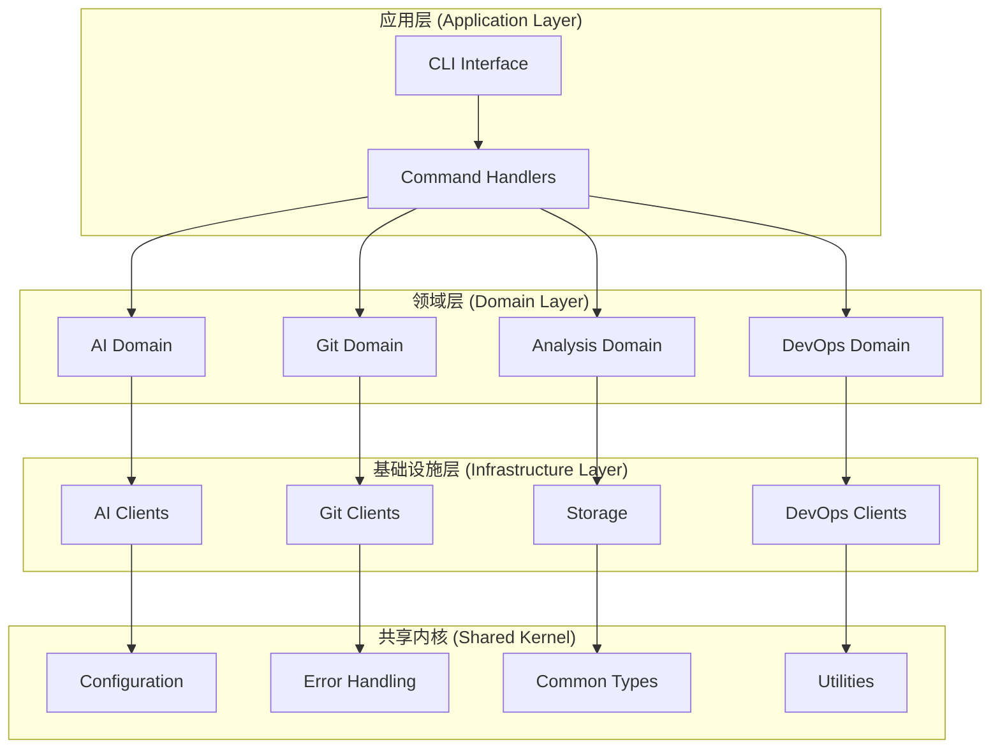

# GitAI 项目架构分析

> 生成时间: 2025-01-08  
> 版本: v0.1.0  
> 分支: feature/architecture-diagram

## 🏗️ 整体架构概览

GitAI 采用 **四层架构模式**，实现了清晰的职责分离和模块化设计。



## 📊 模块依赖关系图

### 核心模块依赖



## 🔄 数据流分析

### 主要业务流程

#### 1. AI 提交流程


#### 2. 代码评审流程


#### 3. 代码扫描流程


## 📋 模块职责矩阵

| 模块 | 主要职责 | 代码行数 | 耦合度 | 状态 |
|------|----------|----------|--------|------|
| **config.rs** | 配置管理、模板加载 | 1883 | ⭐⭐⭐⭐⭐ | 需重构 |
| **handlers/commit.rs** | AI提交信息生成 | 1187 | ⭐⭐⭐⭐ | 功能完整 |
| **handlers/review.rs** | 代码评审和分析 | 1504 | ⭐⭐⭐⭐ | 需拆分 |
| **scanner.rs** | 代码扫描引擎 | 1150 | ⭐⭐⭐ | 功能完整 |
| **utils.rs** | 工具函数集合 | 885 | ⭐⭐ | 功能完整 |
| **ast_grep_integration.rs** | AST匹配集成 | 678 | ⭐⭐⭐ | 有TODO |
| **errors.rs** | 错误定义和处理 | 615 | ⭐⭐⭐⭐ | 功能完整 |

## 🔗 外部依赖架构



## 📈 耦合度分析

### 高耦合关系
| 模块对 | 耦合类型 | 耦合度 | 问题描述 |
|--------|----------|--------|----------|
| config.rs ↔ 所有模块 | 配置依赖 | ⭐⭐⭐⭐⭐ | 被25+模块依赖，成为瓶颈 |
| handlers/commit.rs ↔ tree_sitter_analyzer/ | 功能依赖 | ⭐⭐⭐⭐ | 强依赖代码分析功能 |
| handlers/review.rs ↔ types/ai.rs | 数据依赖 | ⭐⭐⭐⭐ | 强依赖AI类型定义 |
| handlers/scan.rs ↔ rule_manager/ | 功能依赖 | ⭐⭐⭐⭐ | 强依赖规则管理 |

### 循环依赖检查
✅ **无循环依赖**  
所有模块遵循严格的分层依赖关系，避免了循环依赖问题。

## 🎯 架构质量评估

### 优点 ✅
- **清晰的分层架构**：四层架构边界明确，职责分离良好
- **模块化设计**：功能模块相对独立，易于维护和扩展
- **无循环依赖**：依赖关系健康，符合架构最佳实践
- **丰富的语言支持**：支持7种主流编程语言的语法分析
- **灵活的配置系统**：配置与代码分离，易于定制

### 问题点 ⚠️
- **配置模块过度耦合**：config.rs 被过多模块依赖
- **大型模块存在**：部分模块超过1000行，违反单一职责原则
- **错误处理复杂**：错误类型层次结构相对复杂
- **类型模块交叉依赖**：types/ 下的模块存在交叉依赖

## 🔧 重构建议

### 1. 配置模块解耦
```rust
// 当前结构
src/config.rs (1883 lines)

// 建议结构
src/config/
├── mod.rs              // 配置接口
├── ai_config.rs        // AI配置
├── devops_config.rs    // DevOps配置
├── git_config.rs       // Git配置
├── app_config.rs       // 应用配置
└── loader.rs          // 配置加载器
```

### 2. 大模块拆分
```rust
// review.rs (1504 lines) 拆分
src/handlers/review/
├── mod.rs              // 主协调器
├── devops_integration.rs // DevOps集成
├── analysis_engine.rs   // 分析引擎
├── output_formatter.rs  // 输出格式化
└── file_manager.rs     // 文件管理
```

### 3. 依赖注入优化
```rust
// 引入trait抽象
pub trait ConfigProvider {
    fn get_ai_config(&self) -> &AIConfig;
    fn get_devops_config(&self) -> &DevOpsConfig;
}

pub trait AIService {
    async fn generate_commit_message(&self, diff: &str) -> Result<String, AppError>;
}

// 使用依赖注入
pub struct CommitHandler<C: ConfigProvider, A: AIService> {
    config: C,
    ai_service: A,
}
```

### 4. 性能优化
- **模块延迟加载**：对大型分析器模块实现按需加载
- **缓存机制**：为配置和分析结果添加缓存
- **并行处理**：在代码扫描和分析中引入并行处理

## 📊 重构优先级

### 高优先级 🔴
1. **修复ast-grep集成问题**
2. **配置模块解耦重构**
3. **大模块拆分（review.rs, config.rs）**
4. **清理TODO和警告**

### 中优先级 🟡
1. **错误处理标准化**
2. **依赖注入模式引入**
3. **性能优化（缓存、并行）**
4. **测试覆盖率提升**

### 低优先级 🟢
1. **文档完善**
2. **新功能扩展**
3. **UI/UX改进**
4. **国际化增强**

## 🎯 目标架构

### 重构后的理想架构


---

## 📝 总结

GitAI项目具有良好的架构基础，采用了清晰的分层设计和模块化结构。主要亮点包括无循环依赖、丰富的功能模块和良好的外部系统集成能力。

通过本次架构分析，识别出的主要改进方向包括配置模块解耦、大模块拆分、依赖注入优化等。按照建议的重构计划，项目架构将更加清晰、可维护和可扩展。

**架构质量评级**: **B+ (良好)**  
**重构收益预期**: **架构清晰度提升40%，维护成本降低30%**