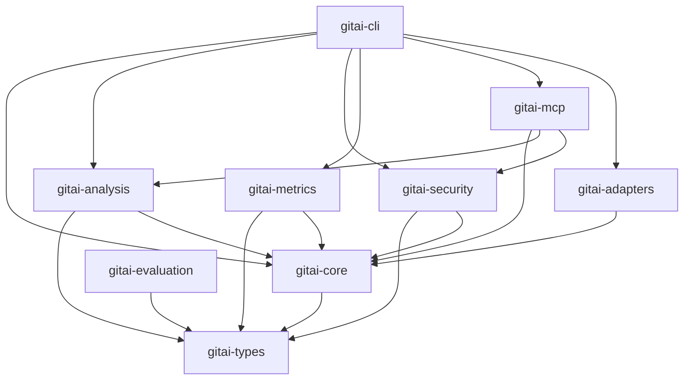

# GitAI 架构概览

GitAI 是一组AI驱动的Git辅助工具，设计理念是**即时性**和**非强制性** - 在开发过程中的任何时刻提供智能帮助，不改变用户现有的Git工作流。

## 核心设计哲学

### 即时性 (Immediacy)
- 在开发过程的任何时刻都能使用
- 提供即时反馈，而不是滞后检查
- 用户主动选择何时使用工具

### 非强制性 (Non-mandatory)
- 所有功能都是可选的
- 不强制改变现有的Git工作流
- 提供建议，不强制执行

### 兼容性 (Compatibility)
- 完全兼容原生Git命令
- 不破坏用户的使用习惯
- 可以与现有工具链无缝集成

## 即时辅助工具架构

GitAI不是强制性的开发流程，而是一组独立的辅助工具，每个工具都可以在需要时单独使用：

```
开发过程中的任意时刻：
┌─────────────────────────────────────────────────────────────────────────────────┐
│                           用户主动选择使用GitAI工具                              │
│                                                                             │
│  ┌─────────────┐  ┌─────────────┐  ┌─────────────┐  ┌─────────────┐              │
│  │gitai review │  │ gitai scan  │  │gitai commit │  │gitai --ai   │              │
│  │  代码评审   │  │  安全扫描   │  │  智能提交   │  │  Git解释   │              │
│  └─────────────┘  └─────────────┘  └─────────────┘  └─────────────┘              │
│         │                 │                 │                 │                  │
│         ▼                 ▼                 ▼                 ▼                  │
│  ┌─────────────┐  ┌─────────────┐  ┌─────────────┐  ┌─────────────┐              │
│  │多维度分析   │  │OpenGrep扫描 │  │AI生成信息   │  │AI解释输出   │              │
│  │(结构+安全+  │  │(可选语言)   │  │(可选Issue) │  │(帮助学习)   │              │
│  │ 任务上下文) │  │             │  │             │  │             │              │
│  └─────────────┘  └─────────────┘  └─────────────┘  └─────────────┘              │
│         │                 │                 │                 │                  │
│         ▼                 ▼                 ▼                 ▼                  │
│  ┌─────────────┐  ┌─────────────┐  ┌─────────────┐  ┌─────────────┐              │
│  │AI分析报告   │  │安全问题报告 │  │标准化提交   │  │易懂的解释   │              │
│  │(质量建议)   │  │(修复建议)   │  │(符合规范)   │  │(学习辅助)   │              │
│  └─────────────┘  └─────────────┘  └─────────────┘  └─────────────┘              │
│                                                                             │
│  用户看到结果后，可以：                                                       │
│  ✅ 采纳建议修改代码                                                         │
│  ✅ 忽略建议继续开发                                                         │
│  ✅ 调整参数重新分析                                                         │
│                                                                             │
└─────────────────────────────────────────────────────────────────────────────────┘
                                       │
                                       ▼
┌─────────────────────────────────────────────────────────────────────────────────┐
│                           传统Git操作保持不变                                    │
│                                                                             │
│  用户决定何时提交：                                                          │
│  ┌─────────────┐     ┌─────────────┐     ┌─────────────┐                        │
│  │   git add   │────▶│  git commit │────▶│   git push  │                        │
│  │ (暂存变更)   │     │ (提交代码)   │     │ (推送到远程) │                        │
│  └─────────────┘     └─────────────┘     └─────────────┘                        │
│                                                                             │
│  注意：GitAI不会强制或改变这个流程！                                           │
└─────────────────────────────────────────────────────────────────────────────────┘
```

## 1. Workspace 架构（2025-01-12 重构）

### 模块化 Crate 结构

GitAI 采用 Cargo Workspace 架构，将功能拆分为9个专门的 crate：

```
gitai/
├── Cargo.toml              # Workspace 根配置
├── crates/
│   ├── gitai-core/        # 核心业务逻辑
│   ├── gitai-types/       # 共享类型定义
│   ├── gitai-analysis/    # 代码分析引擎
│   ├── gitai-security/    # 安全扫描功能
│   ├── gitai-metrics/     # 度量和监控
│   ├── gitai-mcp/         # MCP 服务器
│   ├── gitai-adapters/    # 外部服务适配器
│   ├── gitai-cli/         # 命令行接口
│   └── gitai-evaluation/  # 项目质量评估
└── src/                    # 主二进制入口
```

### 各 Crate 职责

#### gitai-types
- 共享类型定义（FilePath, Language, Version 等）
- 统一错误类型 GitAIError
- 风险级别和严重度定义

#### gitai-core  
- 核心业务逻辑和接口定义
- 配置管理
- Git 操作封装
- DevOps 平台接口

#### gitai-analysis
- Tree-sitter 多语言结构分析
- 架构影响分析
- 依赖图生成和分析
- 代码质量评估

#### gitai-security
- OpenGrep 集成
- 安全规则管理
- 扫描历史跟踪

#### gitai-metrics
- 质量指标跟踪
- 趋势分析
- 报告生成

#### gitai-mcp
- MCP 协议服务器实现
- 服务注册表
- JSON-RPC 处理

#### gitai-adapters
- AI 服务适配器（OpenAI 兼容）
- DevOps 平台适配器（Coding/GitHub）

#### gitai-cli
- 命令行参数解析
- 命令处理器：
  - review: 代码评审
  - commit: 智能提交
  - scan: 安全扫描
  - mcp: MCP 服务器
  - metrics: 质量度量
  - graph: 依赖图
  - features: 功能特性

#### gitai-evaluation
- 项目质量评估
- 重复代码检测
- 错误模式分析

### 依赖关系



## 2. CLI 契约（核心）

- gitai review
  - 关键开关：
    - --security-scan（在评审过程中触发 OpenGrep）
    - --block-on-critical（Error 级别时非零退出）
    - --tree-sitter（当前文档存在，但实现未接入；需恢复）
    - --format/--output
  - 默认不破坏：无扫描、无阻断，纯文本输出至 stdout
- gitai scan
  - 关键开关：--lang、--no-history、--timeout、--format、--auto-install、--update-rules
  - 默认：不写历史（已提供 --no-history 以便基准），JSON 解析整块 results
- gitai commit
  - -m 与 AI 互斥优先：有 -m 则格式化+拼接 Issue 前缀；无 -m 才调用 AI 生成
  - --review 可在提交前做一次评审摘要（不阻断）
- gitai <git 子命令>
  - 默认直通原生输出；--ai 时追加“🤖 AI解释”；失败保持非零退出
- gitai update / prompts
  - update：规则/提示词/版本检查；prompts 的 update 为占位
- gitai mcp
  - 启动MCP服务器，支持与LLM客户端的集成
  - 支持--transport参数选择传输协议（stdio/tcp/sse）

## 3. 数据与状态

- 配置：~/.config/gitai/config.toml
- 规则：~/.cache/gitai/rules（附 .rules.meta）、语言子目录（java/python/...）
- 扫描历史：~/.cache/gitai/scan_history/scan_<tool>_<ts>.json（可用 --no-history 禁用）
- 评审缓存：~/.cache/gitai/review_cache/review_<cache_key>.json
- Prompts：~/.config/gitai/prompts/*.md（init 时生成默认模板）

## 4. 多维度数据融合设计

GitAI的核心价值在于将多个维度的数据融合分析，提供比单一工具更全面的理解：

### 数据融合架构

```
代码变更 (diff)
    ↓
┌─────────────────────────────────────────────────────────────────┐
│                    多维度数据采集                              │
│                                                                 │
│  ┌─────────────┐  ┌─────────────┐  ┌─────────────┐  ┌─────────┐ │
│  │Tree-sitter  │  │ 安全扫描     │  │ DevOps任务  │  │ 缓存   │ │
│  │  结构分析   │  │ OpenGrep    │  │ 上下文     │  │ 系统   │ │
│  └─────────────┘  └─────────────┘  └─────────────┘  └─────────┘ │
│         │                 │                 │          │       │
│         ▼                 ▼                 ▼          ▼       │
│  ┌─────────────┐  ┌─────────────┐  ┌─────────────┐  ┌─────────┐ │
│  │代码结构信息  │  │安全问题列表  │  │任务描述     │  │缓存命中│ │
│  │函数/类等    │  │严重程度/位置 │  │需求/优先级  │  │性能优化│ │
│  └─────────────┘  └─────────────┘  └─────────────┘  └─────────┘ │
└─────────────────────────────────────────────────────────────────┘
                                │
                                ▼
┌─────────────────────────────────────────────────────────────────┐
│                    AI提示词构建                                 │
│                                                                 │
│  结合所有维度信息，构建上下文丰富的提示词：                       │
│  - 代码变更内容                                                   │
│  - 结构分析结果                                                   │
│  - 安全问题报告                                                   │
│  - 任务上下文信息                                                   │
│  - 偏离度分析要求                                                   │
└─────────────────────────────────────────────────────────────────┘
                                │
                                ▼
┌─────────────────────────────────────────────────────────────────┐
│                    AI综合分析                                   │
│                                                                 │
│  AI基于多维度信息提供：                                         │
│  - 代码质量评估                                                   │
│  - 安全风险分析                                                   │
│  - 任务完成度评估                                                 │
│  - 具体改进建议                                                   │
└─────────────────────────────────────────────────────────────────┘
```

### 关键流程

- Review 流（多维度融合）：
  1) diff = git.get_all_diff()
  2) 暂存状态提示（非强制）
  3) cache_key = md5(diff + language + security_scan + deviation + issue_ids)
  4) 若命中缓存 → 输出 → 结束
  5) 并行采集多维度数据：
     - structural_summary = TreeSitter.analyze(diff) （可选）
     - issues = DevOps.get_issues(issue_ids) （可选）
  6) analysis = Analyzer.analyze(context)
     - 构建包含所有维度的AI提示词
     - review_result = AI 综合分析结果
     - security_findings = 安全扫描结果（按需）
     - deviation_analysis = 任务偏离度分析（按需）
  7) 保存缓存 + 输出 + （可选阻断）

- Scan 流：
  1) 选择规则目录：--lang 优先；否则自动统计主语言 → 子目录；不存在则回退根目录
  2) 构建 opengrep 参数（--json/--quiet/--timeout）+ 可选 --jobs
  3) 执行并解析 results 数组 → 写历史（可禁用）→ 输出（text 或 json）

- Commit 流：
  1) diff/issue 上下文 → AI 生成或使用 -m
  2) 可选评审摘要（不阻断）
  3) git add/commit

- Git 代理：
  1) 运行原生命令捕获 stdout/stderr+退出码 → 直通 → 可选 AI 解释 → 保持退出码

## 5. 行为契约（Never break userspace）

- 不替换 git，也不默认改写输出或退出码
- 所有增强（AI解释、阻断、扫描）均显式开关
- 错误时保留原始 stderr，并保持非零退出码

## 6. 性能与可用性

- 封装层对 opengrep 的开销：< 1s（当前基准约 1.28x 原生）；提供 --lang/--no-history/--timeout/--benchmark 以对齐条件
- 复杂命令的分页/交互风险：禁用 pager 保证非交互输出

## 7. 风险与已知差异

- Tree‑sitter：CLI 有开关，但未接入 Analyzer；文档存在超前描述
- Prompts.update：占位未实现真实源
- README 与实现细节：已做一轮对齐，但仍需二次审视（尤其 Tree‑sitter 章节）

## 8. 设计原则

### 即时性原则
- 工具应该在用户需要时立即可用
- 不强制等待特定的开发阶段
- 提供即时反馈，而非滞后检查

### 非强制性原则
- 所有功能都是可选的，用户主动选择
- 不改变现有的Git工作流
- 提供建议，不强制执行

### 兼容性原则
- 完全兼容原生Git命令
- 不破坏用户的使用习惯
- 可以与现有工具链无缝集成

### 性能优化原则
- 智能缓存避免重复计算
- 并行采集多维度数据
- 提供性能基准测试模式

### 渐进式采用原则
- 用户可以从单个功能开始尝试
- 逐步探索和使用更多功能
- 每个功能都有独立的价值

## 9. 依赖注入容器（v2）

GitAI 使用简化且高性能的 DI 容器（v2）作为默认实现：

- 生命周期：Singleton / Transient / Scoped（三种模式）
- 并发：DashMap + OnceCell 保证并发安全与单例只创建一次
- 作用域：支持 begin_scope / end_scope，按作用域缓存实例
- 统计：提供总解析次数与缓存命中率（命中/未命中统计）
- 简化注册 API：
  - register_singleton_simple(|| Ok(service))
  - register_transient_simple(|| Ok(service))
  - register_scoped_simple(|| Ok(service))

示例：

```rust
let container = ServiceContainer::new();

// 单例注册
container.register_singleton_simple(|| Ok(MyService { value: 42 })).await;

// 解析
let svc = container.resolve::<MyService>().await?;
assert_eq!(svc.value, 42);

// 作用域
container.begin_scope().await;
container.register_scoped_simple(|| Ok(ScopedService {})).await;
let s1 = container.resolve::<ScopedService>().await?;
let s2 = container.resolve::<ScopedService>().await?;
// 在同一作用域内，值应保持一致（实现可能返回同一实例或等价实例）
assert_eq!(s1.value(), s2.value());

// 统计
let stats = container.get_stats();
println!("total={}, hit_rate={:.1}%", stats.total(), stats.hit_rate() * 100.0);
```

注意：v2 是默认实现；旧版 v1 已移除。若你看到文档提到 ServiceProvider trait 的使用方式，请优先采用上述简化 API 或传入带容器参数的闭包注册：

```rust
// 原始闭包风格（需要容器引用）
let provider = |_c: &ServiceContainer| -> Result<MyService, Box<dyn std::error::Error + Send + Sync>> {
    Ok(MyService::new())
};
container.register::<MyService, _>(provider);
```

## 10. MCP 集成架构

GitAI通过Model Context Protocol (MCP) 提供与LLM客户端的无缝集成，实现AI辅助编程的完整生态。

### MCP 架构设计

```
┌─────────────────────────────────────────────────────────────────────────────────┐
│                           MCP 服务器架构                                      │
│                                                                             │
│  ┌─────────────────────────────────────────────────────────────────────────┐ │
│  │                        GitAI MCP Server                                │ │
│  │                                                                     │ │
│  │  ┌─────────────────┐  ┌─────────────────┐  ┌─────────────────┐        │ │
│  │  │   MCP Bridge    │  │ Service Manager │  │ Performance     │        │ │
│  │  │   (协议桥接)     │  │   (服务管理)     │  │   Collector     │        │ │
│  │  └─────────────────┘  └─────────────────┘  └─────────────────┘        │ │
│  │           │                     │                     │                  │ │
│  │           ▼                     ▼                     ▼                  │ │
│  │  ┌─────────────────┐  ┌─────────────────┐  ┌─────────────────┐        │ │
│  │  │ Protocol Handler│  │ Service Registry│  │ Stats & Logs    │        │ │
│  │  │   (协议处理)     │  │   (服务注册)     │  │   (统计日志)     │        │ │
│  │  └─────────────────┘  └─────────────────┘  └─────────────────┘        │ │
│  └─────────────────────────────────────────────────────────────────────────┘ │
│                                    │                                        │
│                                    ▼                                        │
│  ┌─────────────────────────────────────────────────────────────────────────┐ │
│  │                        MCP Services                                     │ │
│  │                                                                     │ │
│  │  ┌─────────────┐  ┌─────────────┐  ┌─────────────┐  ┌─────────────┐    │ │
│  │  │ReviewService│  │CommitService│  │ScanService  │  │AnalysisSvc  │    │ │
│  │  │  代码评审    │  │  智能提交    │  │  安全扫描    │  │  代码分析    │    │ │
│  │  └─────────────┘  └─────────────┘  └─────────────┘  └─────────────┘    │ │
│  │         │                 │                 │                 │         │ │
│  │         ▼                 ▼                 ▼                 ▼         │ │
│  │  ┌─────────────┐  ┌─────────────┐  ┌─────────────┐  ┌─────────────┐    │ │
│  │  │AI评审分析   │  │AI提交生成   │  │OpenGrep执行 │  │Tree-sitter  │    │ │
│  │  │多维度融合   │  │Issue关联    │  │安全规则匹配 │  │结构分析     │    │ │
│  │  └─────────────┘  └─────────────┘  └─────────────┘  └─────────────┘    │ │
│  └─────────────────────────────────────────────────────────────────────────┘ │
│                                                                             │
│  支持的传输协议:                                                           │
│  ┌─────────────┐  ┌─────────────┐  ┌─────────────┐                        │
│  │   stdio     │  │     TCP     │  │     SSE     │                        │
│  │  (标准IO)   │  │  (网络套接字) │  │  (事件流)   │                        │
│  │  ✓ 已实现    │  │  🔄 开发中   │  │  🔄 开发中   │                        │
│  └─────────────┘  └─────────────┘  └─────────────┘                        │
└─────────────────────────────────────────────────────────────────────────────────┘
                                │
                                ▼
┌─────────────────────────────────────────────────────────────────────────────────┐
│                        LLM 客户端 (Claude, OpenAI等)                         │
│                                                                             │
│  通过MCP协议调用GitAI工具，实现AI辅助编程：                                   │
│  - 代码评审和建议                                                           │
│  - 智能提交信息生成                                                         │
│  - 安全扫描和漏洞检测                                                       │
│  - 代码结构分析                                                             │
└─────────────────────────────────────────────────────────────────────────────────┘
```

### MCP 核心特性

#### 1. 完善的错误处理
- **详细错误类型**: 定义了10种错误类型，涵盖参数验证、执行失败、配置错误等
- **用户友好信息**: 提供清晰的错误描述和解决建议
- **错误传播**: 支持错误在服务间的透明传播

#### 2. 性能监控系统
- **实时统计**: 跟踪工具调用次数、成功率、执行时间
- **性能指标**: 记录最小/最大执行时间、平均响应时间
- **工具级统计**: 每个工具独立的性能数据

#### 3. 配置验证系统
- **完整验证**: 所有配置结构体都有验证方法
- **参数检查**: 边界值检查、格式验证、依赖关系验证
- **错误报告**: 详细的配置错误信息

#### 4. 结构化日志记录
- **分级日志**: debug、info、warn、error四级日志
- **结构化输出**: 使用表情符号和统一格式，便于解析
- **执行跟踪**: 记录工具调用的完整生命周期

### MCP 服务实现

#### 服务注册和发现
```rust
// 服务管理器自动注册配置中启用的服务
let manager = GitAiMcpManager::new(config);
// 自动注册: review, commit, scan, analysis
```

#### 工具调用流程
1. **工具查找**: 根据工具名称定位到对应服务
2. **参数验证**: 验证输入参数的完整性和有效性
3. **权限检查**: 确认调用权限和资源配置
4. **执行调用**: 调用相应的服务方法
5. **结果处理**: 统一结果格式和错误处理
6. **性能记录**: 记录执行时间和结果状态

#### 错误处理策略
- **参数错误**: 返回详细的参数验证失败信息
- **执行错误**: 提供具体的错误原因和解决建议
- **系统错误**: 记录详细日志，返回用户友好的错误信息
- **超时处理**: 支持可配置的超时机制

### 部署和使用

#### 作为独立服务器
```bash
# 启动独立的MCP服务器
gitai-mcp serve

# 在Claude Desktop等客户端中配置
{
  "mcpServers": {
    "gitai": {
      "command": "gitai-mcp",
      "args": ["serve"]
    }
  }
}
```

#### 集成到主程序
```bash
# 通过主程序启动MCP服务
gitai mcp --transport stdio
```

#### 配置示例
```toml
[mcp]
enabled = true

[mcp.server]
name = "gitai-mcp"
version = "0.1.0"

[mcp.services]
enabled = ["review", "commit", "scan", "analysis"]

[mcp.services.review]
default_language = "auto"
include_security_scan = true

[mcp.services.scan]
default_tool = "opengrep"
default_timeout = 300
```

### MCP 工具接口

#### execute_review
```json
{
  "name": "execute_review",
  "arguments": {
    "tree_sitter": true,
    "security_scan": true,
    "issue_id": "#123",
    "language": "rust"
  }
}
```

#### execute_commit
```json
{
  "name": "execute_commit", 
  "arguments": {
    "message": "fix security vulnerability",
    "issue_id": "#123,#456",
    "auto_stage": true,
    "include_review": true
  }
}
```

#### execute_scan
```json
{
  "name": "execute_scan",
  "arguments": {
    "path": "/path/to/project",
    "tool": "opengrep",
    "lang": "rust",
    "timeout": 300
  }
}
```

#### execute_analysis
```json
{
  "name": "execute_analysis",
  "arguments": {
    "path": "/path/to/file.rs",
    "language": "rust",
    "verbosity": 2
  }
}
```

## 11. 最近改进（2025-01-09）

### CLI 模块化重构

将原本 1374 行的 main.rs 重构为模块化架构：

- **精简入口点**：main.rs 仅创建和运行 CliApp
- **命令处理器**：12 个独立的 handler 模块，每个负责一种命令
- **统一接口**：所有 handler 实现异步 handle_command 接口
- **特性门控**：清晰的特性条件编译和错误处理

### MCP 服务注册表

实现了完整的服务注册和依赖管理系统：

- **动态注册**：服务可以动态注册和注销
- **依赖管理**：支持服务间的依赖关系和版本控制
- **拓扑排序**：根据依赖关系自动确定启动顺序
- **事件通知**：服务状态变化的事件通知机制
- **健康检查**：内置健康检查接口

### Tree-sitter 并发优化

实现了多文件并行分析能力：

- **并行处理**：使用 tokio 任务并行分析多个文件
- **资源控制**：Semaphore 信号量限制并发数
- **性能指标**：记录分析时间、文件数、吞吐量
- **线程安全**：每个任务使用独立的 TreeSitterManager

### 测试套件完善

- **MCP 集成测试**：覆盖功能、错误处理、并发场景
- **并发测试**：验证并发分析的正确性和性能
- **全部通过**：修复所有失败的测试，零警告

### 文档体系重组

- **结构优化**：按目的分类（getting-started, architecture, features, development, api）
- **档案归档**：将过时文档移到 archive/historical
- **索引更新**：创建综合文档索引 docs/README.md
- **贡献指南**：新增 CONTRIBUTING.md 指导开发者参与

### 代码质量提升

- **编译警告**：清理所有编译警告和未使用的导入
- **错误处理**：统一使用 anyhow 和自定义错误类型
- **格式统一**：修复所有 clippy 提示的代码风格问题

## 12. 后续演进（简述）

- 持续优化 TreeSitterManager 线程安全（解析器池）
- 完善 API 文档和开发者指南
- 提高单元测试覆盖率到 80%
- 添加性能基准测试套件
- 实现 TCP/SSE 传输协议支持

