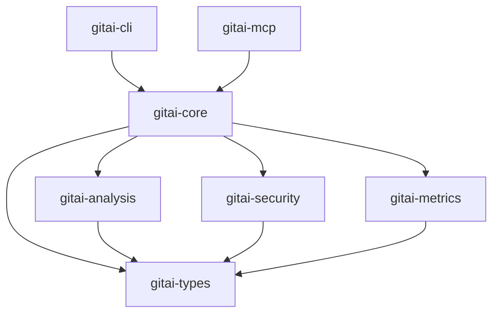

# GitAI 架构重构计划

## 执行摘要

基于技术专家的评审反馈，本文档制定了 GitAI 项目的架构改进计划。主要目标是提升代码复用性、模块化程度、性能表现和可维护性。

## 当前架构问题分析

### 1. 类型系统重复
- **问题**: 多处重复定义 `Severity`、`Finding`、`RiskLevel`、`BreakingChange` 等核心类型
- **影响**: 增加维护成本，容易产生不一致，需要重复的转换逻辑
- **位置**: 
  - `src/scan.rs`: `Severity`、`Finding`
  - `src/architectural_impact.rs`: `RiskLevel`、`BreakingChange`
  - `src/project_insights.rs`: 重复的风险评级概念

### 2. 模块职责不清
- **问题**: 单个模块承担过多职责
- **影响**: 代码耦合度高，难以测试和维护
- **示例**:
  - `review.rs`: 同时处理缓存、AI调用、结构分析、IO操作
  - `commit.rs`: 混合了多种不同层次的关注点

### 3. 上下文管理混乱
- **问题**: `OperationContext` 在多处重复定义
- **影响**: 概念不统一，容易产生歧义
- **位置**:
  - `src/analysis.rs`
  - `src/context.rs`

### 4. 缺乏模块化架构
- **问题**: 所有功能都在单一 crate 中
- **影响**: 编译时间长，无法独立发布组件，二进制体积大

## 架构改进目标

### 短期目标（1-2周）
1. 建立统一的类型系统
2. 拆分职责过重的模块
3. 统一上下文管理

### 中期目标（3-4周）
1. 实现 Cargo Workspace 架构
2. 添加 Feature Gates
3. 增强缓存策略

### 长期目标（1-2月）
1. 完善可观测性基础设施
2. 实现跨平台兼容
3. 建立完整测试体系

## 详细实施方案

### Phase 1: 类型系统统一（第1周）

#### 1.1 创建 gitai-types crate
```toml
# crates/gitai-types/Cargo.toml
[package]
name = "gitai-types"
version = "0.1.0"
edition = "2021"

[dependencies]
serde = { version = "1.0", features = ["derive"] }
chrono = { version = "0.4", features = ["serde"] }
```

#### 1.2 统一的类型定义
```rust
// crates/gitai-types/src/lib.rs
pub mod severity {
    #[derive(Debug, Clone, Copy, PartialEq, Eq, Serialize, Deserialize)]
    pub enum Severity {
        Critical,
        High,
        Medium,
        Low,
        Info,
    }
}

pub mod risk {
    #[derive(Debug, Clone, Copy, PartialEq, Eq, Serialize, Deserialize)]
    pub enum RiskLevel {
        Critical,
        High,
        Medium,
        Low,
    }
}

pub mod finding {
    use super::severity::Severity;
    
    #[derive(Debug, Clone, Serialize, Deserialize)]
    pub struct Finding {
        pub severity: Severity,
        pub message: String,
        pub file: Option<String>,
        pub line: Option<usize>,
        pub rule_id: Option<String>,
    }
}

pub mod breaking_change {
    use super::risk::RiskLevel;
    
    #[derive(Debug, Clone, Serialize, Deserialize)]
    pub struct BreakingChange {
        pub description: String,
        pub affected_components: Vec<String>,
        pub risk_level: RiskLevel,
        pub migration_path: Option<String>,
    }
}
```

### Phase 2: Workspace 架构（第2周）

#### 2.1 新的项目结构
```
gitai/
├── Cargo.toml              # Workspace root
├── crates/
│   ├── gitai-core/         # 核心功能库
│   │   ├── Cargo.toml
│   │   └── src/
│   │       ├── lib.rs
│   │       ├── git.rs
│   │       ├── ai.rs
│   │       └── context.rs
│   ├── gitai-types/        # 共享类型
│   │   ├── Cargo.toml
│   │   └── src/
│   │       └── lib.rs
│   ├── gitai-cli/          # CLI应用
│   │   ├── Cargo.toml
│   │   └── src/
│   │       └── main.rs
│   ├── gitai-mcp/          # MCP服务器
│   │   ├── Cargo.toml
│   │   └── src/
│   │       ├── lib.rs
│   │       └── main.rs
│   ├── gitai-metrics/      # 度量系统
│   │   ├── Cargo.toml
│   │   └── src/
│   │       └── lib.rs
│   ├── gitai-security/     # 安全扫描
│   │   ├── Cargo.toml
│   │   └── src/
│   │       └── lib.rs
│   └── gitai-analysis/     # 代码分析
│       ├── Cargo.toml
│       └── src/
│           ├── lib.rs
│           ├── tree_sitter/
│           └── dependency_graph/
```

#### 2.2 Workspace Cargo.toml
```toml
[workspace]
members = [
    "crates/gitai-core",
    "crates/gitai-types",
    "crates/gitai-cli",
    "crates/gitai-mcp",
    "crates/gitai-metrics",
    "crates/gitai-security",
    "crates/gitai-analysis",
]
resolver = "2"

[workspace.package]
version = "0.1.0"
edition = "2021"
authors = ["GitAI Team"]
license = "MIT"

[workspace.dependencies]
serde = { version = "1.0", features = ["derive"] }
serde_json = "1.0"
tokio = { version = "1.45", features = ["full"] }
anyhow = "1.0"
log = "0.4"
chrono = { version = "0.4", features = ["serde"] }
```

### Phase 3: 模块重构（第3周）

#### 3.1 Review 模块拆分
```rust
// crates/gitai-core/src/review/mod.rs
pub mod executor;    // 执行逻辑
pub mod cache;       // 缓存管理
pub mod converter;   // 格式转换
pub mod adapters;    // 外部适配

// crates/gitai-core/src/review/executor.rs
use gitai_types::{Finding, Severity};
use crate::context::OperationContext;

pub struct ReviewExecutor {
    context: OperationContext,
}

impl ReviewExecutor {
    pub async fn execute(&self) -> Result<ReviewResult> {
        // 纯执行逻辑，不涉及缓存和IO
    }
}

// crates/gitai-core/src/review/cache.rs
pub struct ReviewCache {
    cache_dir: PathBuf,
}

impl ReviewCache {
    pub fn get(&self, key: &str) -> Option<ReviewResult> {
        // 缓存逻辑独立
    }
    
    pub fn set(&self, key: &str, result: &ReviewResult) {
        // 缓存写入
    }
}
```

#### 3.2 统一的 Context 管理
```rust
// crates/gitai-core/src/context.rs
use gitai_types::*;
use std::sync::Arc;

#[derive(Clone)]
pub struct OperationContext {
    pub config: Arc<Config>,
    pub git_context: GitContext,
    pub ai_client: Option<Arc<AIClient>>,
    pub devops_client: Option<Arc<DevOpsClient>>,
    pub metrics_collector: Arc<MetricsCollector>,
}

#[derive(Default)]
pub struct OperationOptions {
    pub verbose: bool,
    pub dry_run: bool,
    pub cache_enabled: bool,
    pub timeout: Option<Duration>,
}

impl OperationContext {
    pub fn with_options(mut self, options: OperationOptions) -> Self {
        // 应用选项
        self
    }
}
```

### Phase 4: Feature Gates（第4周）

#### 4.1 语言支持的 Feature Gates
```toml
# crates/gitai-analysis/Cargo.toml
[features]
default = ["rust", "python", "javascript"]
all-languages = ["rust", "java", "python", "javascript", "typescript", "go", "c", "cpp"]
rust = ["tree-sitter-rust"]
java = ["tree-sitter-java"]
python = ["tree-sitter-python"]
javascript = ["tree-sitter-javascript"]
typescript = ["tree-sitter-typescript"]
go = ["tree-sitter-go"]
c = ["tree-sitter-c"]
cpp = ["tree-sitter-cpp"]

[dependencies]
tree-sitter = "0.20"
tree-sitter-rust = { version = "0.20", optional = true }
tree-sitter-java = { version = "0.20", optional = true }
# ... 其他语言依赖
```

#### 4.2 功能特性的 Feature Gates
```toml
# crates/gitai-core/Cargo.toml
[features]
default = ["ai", "cache", "metrics"]
ai = ["dep:reqwest"]
cache = ["dep:lru", "dep:md5"]
metrics = ["gitai-metrics"]
security = ["gitai-security"]
full = ["ai", "cache", "metrics", "security"]
```

### Phase 5: 性能优化（第5周）

#### 5.1 增强的缓存策略
```rust
// crates/gitai-core/src/cache/strategy.rs
use std::time::{Duration, SystemTime};

pub struct CacheConfig {
    pub max_size: usize,
    pub ttl: Duration,
    pub eviction_policy: EvictionPolicy,
}

pub enum EvictionPolicy {
    LRU,
    LFU,
    FIFO,
}

pub struct CacheEntry<T> {
    pub data: T,
    pub created_at: SystemTime,
    pub accessed_at: SystemTime,
    pub access_count: usize,
}

pub trait CacheStrategy<K, V> {
    fn get(&mut self, key: &K) -> Option<&V>;
    fn insert(&mut self, key: K, value: V);
    fn evict(&mut self);
    fn should_evict(&self, entry: &CacheEntry<V>) -> bool;
}
```

#### 5.2 Dependency Graph 优化
```rust
// crates/gitai-analysis/src/dependency_graph/incremental.rs
use petgraph::graph::Graph;
use std::collections::HashSet;

pub struct IncrementalDependencyGraph {
    graph: Graph<String, ()>,
    dirty_nodes: HashSet<NodeIndex>,
}

impl IncrementalDependencyGraph {
    pub fn update_node(&mut self, node: NodeIndex, new_deps: Vec<NodeIndex>) {
        self.dirty_nodes.insert(node);
        // 只更新受影响的部分
    }
    
    pub fn compute_centrality_incremental(&mut self) -> HashMap<NodeIndex, f64> {
        // 增量计算中心性
    }
}

// 并行化计算
pub fn parallel_centrality_computation(graph: &Graph<String, ()>) -> HashMap<NodeIndex, f64> {
    use rayon::prelude::*;
    
    graph.node_indices()
        .par_bridge()
        .map(|node| {
            let centrality = compute_node_centrality(graph, node);
            (node, centrality)
        })
        .collect()
}
```

### Phase 6: 可观测性（第6周）

#### 6.1 OpenTelemetry 集成
```rust
// crates/gitai-core/src/observability/mod.rs
use opentelemetry::{global, sdk::propagation::TraceContextPropagator};
use opentelemetry_jaeger::Pipeline;
use tracing_subscriber::layer::SubscriberExt;

pub fn init_telemetry() -> Result<()> {
    global::set_text_map_propagator(TraceContextPropagator::new());
    
    let tracer = opentelemetry_jaeger::new_pipeline()
        .with_service_name("gitai")
        .install_batch(opentelemetry::runtime::Tokio)?;
    
    let telemetry = tracing_opentelemetry::layer().with_tracer(tracer);
    
    let subscriber = tracing_subscriber::Registry::default()
        .with(telemetry)
        .with(tracing_subscriber::fmt::layer());
    
    tracing::subscriber::set_global_default(subscriber)?;
    Ok(())
}

// 使用示例
#[tracing::instrument(skip(context))]
pub async fn review_with_tracing(context: &OperationContext) -> Result<ReviewResult> {
    let span = tracing::info_span!("code_review");
    let _enter = span.enter();
    
    tracing::info!("Starting code review");
    // 实际逻辑
}
```

#### 6.2 结构化日志
```rust
// crates/gitai-core/src/logging/structured.rs
use serde_json::json;
use log::{Record, Level, Metadata};

pub struct StructuredLogger;

impl log::Log for StructuredLogger {
    fn enabled(&self, metadata: &Metadata) -> bool {
        metadata.level() <= Level::Info
    }
    
    fn log(&self, record: &Record) {
        if self.enabled(record.metadata()) {
            let log_entry = json!({
                "timestamp": chrono::Utc::now(),
                "level": record.level().to_string(),
                "target": record.target(),
                "message": record.args().to_string(),
                "file": record.file(),
                "line": record.line(),
            });
            
            println!("{}", serde_json::to_string(&log_entry).unwrap());
        }
    }
    
    fn flush(&self) {}
}
```

### Phase 7: 跨平台支持（第7周）

#### 7.1 通知接口抽象
```rust
// crates/gitai-core/src/notification/mod.rs
use async_trait::async_trait;

#[async_trait]
pub trait NotificationProvider {
    async fn send(&self, title: &str, message: &str) -> Result<()>;
    fn is_available(&self) -> bool;
}

// macOS 实现
#[cfg(target_os = "macos")]
pub mod macos {
    use super::*;
    
    pub struct MacOSNotifier;
    
    #[async_trait]
    impl NotificationProvider for MacOSNotifier {
        async fn send(&self, title: &str, message: &str) -> Result<()> {
            // osascript 实现
        }
        
        fn is_available(&self) -> bool {
            std::process::Command::new("which")
                .arg("osascript")
                .status()
                .map(|s| s.success())
                .unwrap_or(false)
        }
    }
}

// Linux 实现
#[cfg(target_os = "linux")]
pub mod linux {
    use super::*;
    
    pub struct LinuxNotifier;
    
    #[async_trait]
    impl NotificationProvider for LinuxNotifier {
        async fn send(&self, title: &str, message: &str) -> Result<()> {
            // notify-send 实现
        }
        
        fn is_available(&self) -> bool {
            std::process::Command::new("which")
                .arg("notify-send")
                .status()
                .map(|s| s.success())
                .unwrap_or(false)
        }
    }
}

// Windows 实现
#[cfg(target_os = "windows")]
pub mod windows {
    use super::*;
    
    pub struct WindowsNotifier;
    
    #[async_trait]
    impl NotificationProvider for WindowsNotifier {
        async fn send(&self, title: &str, message: &str) -> Result<()> {
            // Windows Toast 通知
        }
        
        fn is_available(&self) -> bool {
            true // Windows 10+ 默认支持
        }
    }
}

// 工厂函数
pub fn create_notifier() -> Box<dyn NotificationProvider> {
    #[cfg(target_os = "macos")]
    return Box::new(macos::MacOSNotifier);
    
    #[cfg(target_os = "linux")]
    return Box::new(linux::LinuxNotifier);
    
    #[cfg(target_os = "windows")]
    return Box::new(windows::WindowsNotifier);
}
```

### Phase 8: 测试体系（第8周）

#### 8.1 分层测试结构
```
tests/
├── unit/               # 单元测试
│   ├── core/
│   ├── types/
│   └── analysis/
├── integration/        # 集成测试
│   ├── cli/
│   ├── mcp/
│   └── security/
├── e2e/               # 端到端测试
│   ├── workflows/
│   └── scenarios/
├── bench/             # 基准测试
│   ├── performance/
│   └── algorithms/
└── fixtures/          # 测试数据
    ├── repos/
    └── configs/
```

#### 8.2 基准测试示例
```rust
// benches/centrality.rs
use criterion::{black_box, criterion_group, criterion_main, Criterion};
use gitai_analysis::dependency_graph::{Graph, compute_centrality};

fn bench_centrality(c: &mut Criterion) {
    let small_graph = create_graph(10, 20);
    let medium_graph = create_graph(100, 500);
    let large_graph = create_graph(1000, 5000);
    
    c.bench_function("centrality_small", |b| {
        b.iter(|| compute_centrality(black_box(&small_graph)))
    });
    
    c.bench_function("centrality_medium", |b| {
        b.iter(|| compute_centrality(black_box(&medium_graph)))
    });
    
    c.bench_function("centrality_large", |b| {
        b.iter(|| compute_centrality(black_box(&large_graph)))
    });
}

criterion_group!(benches, bench_centrality);
criterion_main!(benches);
```

#### 8.3 端到端测试示例
```rust
// tests/e2e/review_workflow.rs
use gitai_cli::run_command;
use tempfile::TempDir;

#[tokio::test]
async fn test_complete_review_workflow() {
    // 设置测试环境
    let temp_dir = TempDir::new().unwrap();
    let repo_path = setup_test_repo(&temp_dir);
    
    // 初始化配置
    run_command(&["init", "--path", &repo_path]).await.unwrap();
    
    // 执行代码审查
    let output = run_command(&[
        "review",
        "--path", &repo_path,
        "--security-scan",
        "--tree-sitter",
    ]).await.unwrap();
    
    // 验证输出
    assert!(output.contains("Review completed"));
    assert!(output.contains("Security scan"));
    assert!(output.contains("Structure analysis"));
    
    // 验证缓存
    let cache_path = format!("{}/.cache/gitai/review_cache", temp_dir.path().display());
    assert!(std::path::Path::new(&cache_path).exists());
}
```

## 迁移策略

### 第一阶段：准备工作（第1-2周）
1. 创建新的 workspace 结构
2. 逐步迁移类型定义到 gitai-types
3. 保持向后兼容性

### 第二阶段：核心重构（第3-4周）
1. 拆分大型模块
2. 统一上下文管理
3. 实现 feature gates

### 第三阶段：优化增强（第5-6周）
1. 性能优化
2. 添加可观测性
3. 跨平台支持

### 第四阶段：质量保证（第7-8周）
1. 完善测试体系
2. 性能基准测试
3. 文档更新

## 成功指标

### 技术指标
- [ ] 编译时间减少 40%
- [ ] 二进制体积减少 30%（通过 feature gates）
- [ ] 测试覆盖率达到 80%
- [ ] 关键路径性能提升 25%

### 架构指标
- [ ] 模块间耦合度降低（循环依赖为 0）
- [ ] 代码重复率降低到 5% 以下
- [ ] 所有公共 API 都有文档
- [ ] 支持 Windows、Linux、macOS 三大平台

### 质量指标
- [ ] 无 P0/P1 级别的架构缺陷
- [ ] 所有关键算法都有基准测试
- [ ] 端到端测试覆盖核心工作流
- [ ] 可观测性覆盖所有关键操作

## 风险管理

### 技术风险
1. **向后兼容性**: 通过逐步迁移和版本管理控制
2. **性能退化**: 每个阶段都进行基准测试
3. **依赖冲突**: 使用 workspace 统一管理依赖版本

### 项目风险
1. **时间估算不准**: 预留 20% 的缓冲时间
2. **团队学习成本**: 编写详细的迁移指南和文档
3. **生产环境影响**: 使用 feature flag 控制新功能的发布

## 后续计划

### 长期优化
1. 探索 WASM 支持，实现更广泛的部署场景
2. 实现插件系统，支持第三方扩展
3. 建立性能监控和自动化优化系统
4. 探索 AI 模型的本地化部署

### 社区建设
1. 开源核心组件
2. 建立贡献者指南
3. 创建插件市场
4. 定期技术分享和培训

## 附录

### A. 依赖关系图


### B. 时间线
```
Week 1-2: Type System Unification
Week 3-4: Workspace Structure
Week 5-6: Module Refactoring
Week 7-8: Performance & Observability
Week 9-10: Cross-platform & Testing
Week 11-12: Documentation & Release
```

### C. 参考资料
- [Cargo Workspaces](https://doc.rust-lang.org/book/ch14-03-cargo-workspaces.html)
- [OpenTelemetry Rust](https://github.com/open-telemetry/opentelemetry-rust)
- [Criterion.rs](https://github.com/bheisler/criterion.rs)
- [Tree-sitter Documentation](https://tree-sitter.github.io/tree-sitter/)
