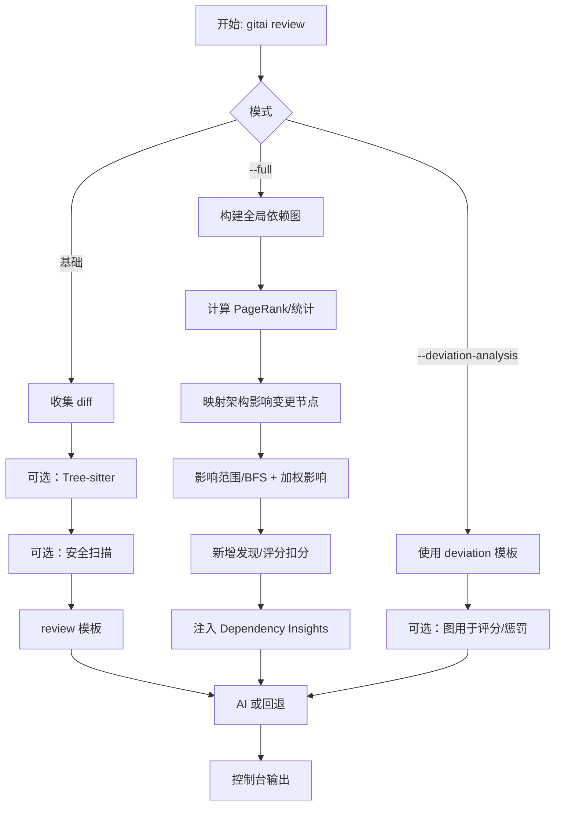

# GitAI 评审命令中的依赖图与 PageRank 分析

## 概述
`gitai review` 支持在评审中引入依赖图分析、PageRank 中心性与架构影响洞察。该能力主要通过 `--full` 开启；为兼容历史，`--deviation-analysis` 也可能触发图分析用于内部评分与发现，但只有在 `--full` 模式下才会将“依赖洞察”注入到 AI 提示词。

- `--full`：构建全局依赖图，计算 PageRank，识别关键节点，评估影响范围，并将“依赖洞察”注入到 `review` 模板；若提供 `--issue-id`，也会拉取 DevOps Issue 上下文。
- `--deviation-analysis`：聚焦 DevOps 需求偏离度分析，使用 `deviation` 模板；图分析仅用于内部发现/分数调整，不注入提示词文本。

## 当前状态
- 依赖图、PageRank 与影响分析已集成到评审流程。
- 命中“关键节点”的变更会新增高严重级别的发现项（Finding）。
- 若存在关键节点命中，会对总体评分进行扣分调整。

## 工作机制

### 1) 全局依赖图构建
当启用 `--full`（或兼容地启用 `--deviation-analysis`）时：
- 以当前工作目录为范围构建依赖图
- 计算 PageRank 分数
- 收集统计（节点数、边数、平均度）
- 基于中心性阈值识别关键节点

将架构影响（ArchitecturalImpact）中识别的“变更函数/类”映射到图中，用于：
- 评估节点重要性/中心性
- 通过 BFS 与加权传播估算影响范围

### 2) 融合架构影响
架构影响分析会提取“函数/类/接口”的变更点，并汇总受影响的模块与潜在破坏性变更，这些结果用于决定在依赖图中需要重点评估的节点。

### 3) 提示词注入规则
- `--full`：在 `review` 模板中注入精炼的“依赖洞察”片段（图规模、PageRank Top、影响度 Top 等）。
- `--deviation-analysis`：使用 `deviation` 模板，强调需求符合/偏离；图分析仅用于内部评分与发现，不注入文本。

### 4) DevOps Issue 上下文（可选）
在 `--full` 且传入 `--issue-id` 时，会获取 DevOps Issue 详情并附加到提示词。可一次性传入多个 ID（如 `--issue-id "#123,#456"`）。

## 评审流程图



## 用法

- 全量架构评审（含依赖洞察与安全扫描）：
```bash
./target/release/gitai review --full --tree-sitter --security-scan --scan-tool=opengrep
```

- 带 DevOps 上下文的全量评审：
```bash
./target/release/gitai review --full --issue-id="#123,#456"
```

- 仅偏离度分析（使用 `deviation` 模板）：
```bash
./target/release/gitai review --deviation-analysis --issue-id="#123"
```

## 全量模式下的输出要点
- 图规模：节点/边与平均度
- 关键节点数量；命中关键节点的变更作为高严重发现项
- PageRank Top 与 影响度 Top（启发式排序）
- 按关键节点命中次数对评分进行调整

## 数据流（全量模式）
1. 结构分析 → 可选的 `StructuralSummary`（建议配合 `--tree-sitter`）
2. 架构影响 → 变更的函数/类/接口
3. 全局依赖图 → PageRank、中心性与统计
4. 影响范围 → 从变更节点出发的 BFS 与加权传播
5. 发现 + 评分调整 → 命中关键节点追加高严重发现项
6. 提示词（review）→ 注入依赖洞察与可选 DevOps 上下文

## 提示词模板
- `assets/prompts/review.md` – 标准/全量评审；依赖洞察仅在全量模式注入
- `assets/prompts/commit.md` – `gitai commit` 使用
- `assets/prompts/deviation.md` – `--deviation-analysis` 时使用

模板初始化/更新：
```bash
gitai prompts init
gitai prompts update
```

## 限制
- 全局依赖图会扫描当前目录；大型仓库耗时更久
- 中心性/阈值为启发式，可在代码中调整
- 动态/运行时依赖难以完全捕获

## 使用建议
- 大型仓库可先导出 DOT 进行离线查看：
```bash
gitai graph --path=. --output=deps.dot --threshold=0.15
```

- 准备发布前建议结合安全扫描：
```bash
gitai review --full --security-scan --block-on-critical
```
