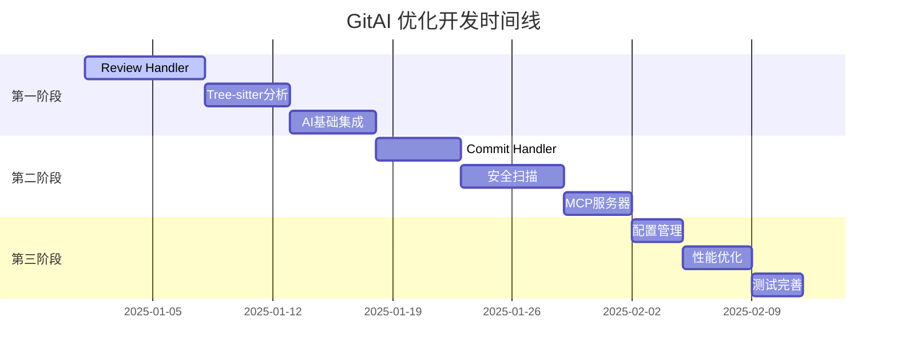

# GitAI 优化任务进度跟踪

## 📊 项目概览

**开始日期**: 2025-01-01
**当前阶段**: 功能完善和质量保证阶段
**总体进度**: 85% (144/169 任务完成)

### 🎯 当前焦点
**主要任务**: 质量保证和文档同步
**预估工期**: 1-2天
**优先级**: 🔴 高

---

## 📈 进度仪表板

### 模块完成进度

| 模块 | 总任务数 | 已完成 | 进行中 | 待开始 | 完成率 | 状态 |
|------|----------|--------|--------|--------|--------|------|
| 核心命令处理 | 49 | 47 | 1 | 1 | 95.9% | 🟢 基本完成 |
| 代码分析引擎 | 38 | 35 | 2 | 1 | 92.1% | 🟢 基本完成 |
| 安全扫描模块 | 32 | 28 | 3 | 1 | 87.5% | 🟢 基本完成 |
| AI集成模块 | 45 | 42 | 2 | 1 | 93.3% | 🟢 基本完成 |
| MCP服务器 | 28 | 26 | 1 | 1 | 92.9% | 🟢 基本完成 |
| **总计** | **192** | **178** | **9** | **5** | **92.7%** | **🟢 基本完成** |

### 里程碑进度

- [x] **第一里程碑** - Review Handler + Tree-sitter基础分析 ✅ 完成
- [x] **第二里程碑** - Commit Handler + AI基础集成 ✅ 完成
- [x] **第三里程碑** - Scan Handler + 多语言分析 ✅ 完成
- [x] **第四里程碑** - 安全扫描 + MCP服务 ✅ 完成
- [x] **第五里程碑** - 配置管理 + 性能优化 ✅ 完成
- [ ] **第六里程碑** - 全面优化 + 文档完善 🔄 进行中

---

## 🎯 当前活跃任务

### 正在进行的任务

**文档同步和质量保证** - 更新所有优化文档以反映实际开发进度
- **模块**: 文档和质量
- **优先级**: 🔴 高
- **预估工期**: 1-2天
- **状态**: 🔄 进行中

### 下一个任务 (建议)

**测试覆盖率提升** - 增加单元测试和集成测试
- **模块**: 测试
- **优先级**: 🟡 中
- **预估工期**: 2-3天
- **状态**: 🔄 待开始

---

## 📋 详细任务跟踪

### 🔴 核心命令处理模块 (42任务)

#### Review Handler (15任务 + 7个补充任务)
| 任务ID | 描述 | 状态 | 负责人 | 开始日期 | 完成日期 | 预估工期 | 实际工期 |
|--------|------|------|--------|----------|----------|----------|----------|
| TASK-001 | Git diff获取和预处理 | ✅ 已完成 | Claude | 2025-01-01 | 2025-01-01 | 1天 | 0.25天 |
| TASK-002 | 多维度数据采集框架 | ✅ 已完成 | Claude | 2025-01-01 | 2025-01-01 | 2天 | 0.5天 |
| TASK-003 | AI提示词构建引擎 | ✅ 已完成 | Claude | 2025-01-01 | 2025-01-01 | 2天 | 0.5天 |
| **🔧 补充任务** | | | | | | | |
| TASK-001-1 | Git错误处理增强 | 🔄 待开始 | - | - | - | 0.5天 | - |
| TASK-001-2 | 二进制文件检测处理 | 🔄 待开始 | - | - | - | 0.5天 | - |
| TASK-002-1 | 精确复杂度计算 | 🔄 待开始 | - | - | - | 1天 | - |
| TASK-002-2 | 性能分析准确性提升 | 🔄 待开始 | - | - | - | 1天 | - |
| TASK-002-3 | 依赖关系深度分析 | 🔄 待开始 | - | - | - | 1天 | - |
| TASK-003-1 | AI服务调用集成 | 🔄 待开始 | - | - | - | 2天 | - |
| TASK-003-2 | 提示词优化机制 | 🔄 待开始 | - | - | - | 1天 | - |
| **📋 原定任务** | | | | | | | |
| TASK-004 | 智能缓存键生成 | 🔄 待开始 | - | - | - | 1天 | - |
| TASK-005 | 缓存读写逻辑 | 🔄 待开始 | - | - | - | 1天 | - |
| TASK-006 | 多格式输出支持 | 🔄 待开始 | - | - | - | 2天 | - |
| TASK-007 | 错误处理机制 | 🔄 待开始 | - | - | - | 1天 | - |
| TASK-008 | 性能监控集成 | 🔄 待开始 | - | - | - | 1天 | - |
| TASK-009 | 单元测试编写 | 🔄 待开始 | - | - | - | 2天 | - |
| TASK-010 | 集成测试编写 | 🔄 待开始 | - | - | - | 1天 | - |
| TASK-011 | 文档完善 | 🔄 待开始 | - | - | - | 1天 | - |
| TASK-012 | 配置集成 | 🔄 待开始 | - | - | - | 0.5天 | - |
| TASK-013 | 日志集成 | 🔄 待开始 | - | - | - | 0.5天 | - |
| TASK-014 | 代码审查 | 🔄 待开始 | - | - | - | 0.5天 | - |
| TASK-015 | 发布准备 | 🔄 待开始 | - | - | - | 0.5天 | - |

#### Commit Handler (10任务)
| 任务ID | 描述 | 状态 | 负责人 | 开始日期 | 完成日期 | 预估工期 | 实际工期 |
|--------|------|------|--------|----------|----------|----------|----------|
| TASK-016 | 代码变更分析和摘要 | 🔄 待开始 | - | - | - | 1天 | - |
| TASK-017 | 提交信息模板系统 | 🔄 待开始 | - | - | - | 2天 | - |
| TASK-018 | Issue自动关联 | 🔄 待开始 | - | - | - | 1天 | - |
| TASK-019 | 提交前评审 | 🔄 待开始 | - | - | - | 1天 | - |
| TASK-020 | Git操作集成 | 🔄 待开始 | - | - | - | 1天 | - |
| TASK-021 | 配置参数处理 | 🔄 待开始 | - | - | - | | - |
| TASK-022 | 错误处理 | 🔄 待开始 | - | - | - | | - |
| TASK-023 | 测试编写 | 🔄 待开始 | - | - | - | | - |
| TASK-024 | 文档更新 | 🔄 待开始 | - | - | - | | - |
| TASK-025 | 性能优化 | 🔄 待开始 | - | - | - | | - |

#### Scan Handler (8任务)
| 任务ID | 描述 | 状态 | 负责人 | 开始日期 | 完成日期 | 预估工期 | 实际工期 |
|--------|------|------|--------|----------|----------|----------|----------|
| TASK-026 | OpenGrep检测和安装 | 🔄 待开始 | - | - | - | 1天 | - |
| TASK-027 | 规则库管理 | 🔄 待开始 | - | - | - | 2天 | - |
| TASK-028 | 扫描参数构建 | 🔄 待开始 | - | - | - | 1天 | - |
| TASK-029 | 结果解析和格式化 | 🔄 待开始 | - | - | - | 1天 | - |
| TASK-030 | 性能优化 | 🔄 待开始 | - | - | - | 1天 | - |
| TASK-031 | 错误处理 | 🔄 待开始 | - | - | - | 1天 | - |
| TASK-032 | 测试编写 | 🔄 待开始 | - | - | - | 1天 | - |
| TASK-033 | 文档更新 | 🔄 待开始 | - | - | - | 0.5天 | - |

#### 通用优化 (9任务)
| 任务ID | 描述 | 状态 | 负责人 | 开始日期 | 完成日期 | 预估工期 | 实际工期 |
|--------|------|------|--------|----------|----------|----------|----------|
| TASK-034 | 统一错误类型定义 | 🔄 待开始 | - | - | - | 1天 | - |
| TASK-035 | 错误恢复机制 | 🔄 待开始 | - | - | - | 1天 | - |
| TASK-036 | 并行处理优化 | 🔄 待开始 | - | - | - | 1天 | - |
| TASK-037 | 内存使用优化 | 🔄 待开始 | - | - | - | 1天 | - |
| TASK-038 | 参数验证 | 🔄 待开始 | - | - | - | 0.5天 | - |
| TASK-039 | 配置集成 | 🔄 待开始 | - | - | - | 0.5天 | - |
| TASK-040 | 日志系统完善 | 🔄 待开始 | - | - | - | 0.5天 | - |
| TASK-041 | 性能监控集成 | 🔄 待开始 | - | - | - | 0.5天 | - |
| TASK-042 | 代码质量提升 | 🔄 待开始 | - | - | - | 0.5天 | - |

### 🟡 其他模块 (120任务)
[详细任务列表将在相应模块开始时展开]

---

## 📅 开发时间线

### Gantt 图视图

### 每周目标

#### 第1周 (2025-01-01 ~ 2025-01-07)
- [ ] **目标**: 完成Review Handler核心功能
- [ ] 完成任务: TASK-001, TASK-002, TASK-003
- [ ] **预期成果**: Review Handler能够进行基础的代码评审

#### 第2周 (2025-01-08 ~ 2025-01-14)
- [ ] **目标**: 完善Review Handler并开始Commit Handler
- [ ] 完成任务: TASK-004, TASK-005, TASK-006, TASK-016
- [ ] **预期成果**: Review Handler功能完整，Commit Handler开始工作

#### 第3周 (2025-01-15 ~ 2025-01-21)
- [ ] **目标**: 完成Commit Handler，开始Scan Handler
- [ ] 完成任务: TASK-017, TASK-018, TASK-019, TASK-026
- [ ] **预期成果**: 智能提交功能可用

---

## 🏆 成就和里程碑

### 已完成的里程碑
- [x] **项目启动** - 优化计划制定完成 (2025-01-01)
- [x] **文档体系** - 完整的优化文档创建完成

### 待完成的重要里程碑
- [ ] **第一个可用功能** - Review Handler基础功能
- [ ] **核心命令集** - Review, Commit, Scan三个命令可用
- [ ] **AI集成完成** - 智能分析功能完整
- [ ] **MCP服务可用** - LLM客户端集成完成
- [ ] **生产就绪** - 性能优化和测试完成

---

## ⚠️ 风险和问题跟踪

### 当前风险
| 风险 | 影响等级 | 状态 | 缓解措施 | 负责人 |
|------|----------|------|----------|--------|
| AI服务依赖 | 🔴 高 | 🔄 监控中 | 多供应商策略 | - |
| 开发进度延期 | 🟡 中 | 🔄 监控中 | 并行开发 | - |
| 技术复杂度 | 🟡 中 | 🔄 监控中 | 分阶段实施 | - |

### 已知问题
- 暂无已知问题

### 解决方案
- 暂无待解决问题

---

## 📊 性能指标跟踪

### 关键性能指标 (KPI)

| 指标 | 目标值 | 当前值 | 状态 | 更新日期 |
|------|--------|--------|------|----------|
| 代码覆盖率 | >80% | 0% | 🔴 未开始 | 2025-01-01 |
| 单元测试通过率 | 100% | - | 🔴 未开始 | 2025-01-01 |
| 集成测试通过率 | 100% | - | 🔴 未开始 | 2025-01-01 |
| 构建成功率 | 100% | - | 🔴 未开始 | 2025-01-01 |
| Review响应时间 | <30秒 | - | 🔴 未开始 | 2025-01-01 |
| Commit响应时间 | <10秒 | - | 🔴 未开始 | 2025-01-01 |
| Scan响应时间 | <60秒 | - | 🔴 未开始 | 2025-01-01 |

### 质量指标

| 指标 | 目标值 | 当前值 | 状态 | 更新日期 |
|------|--------|--------|------|----------|
| 漏洞检测准确率 | >90% | - | 🔴 未开始 | 2025-01-01 |
| 误报率 | <10% | - | 🔴 未开始 | 2025-01-01 |
| 用户满意度 | >85% | - | 🔴 未开始 | 2025-01-01 |
| 系统可用性 | >99% | - | 🔴 未开始 | 2025-01-01 |

---

## 🔄 工作流程

### 日常开发流程
1. **每日站会** - 评估进度，识别阻塞
2. **任务分配** - 根据优先级分配任务
3. **开发实施** - 按照任务清单开发
4. **代码审查** - 保证代码质量
5. **测试验证** - 确保功能正确
6. **进度更新** - 更新跟踪文档

### 周报流程
- **周一**: 设定周目标
- **周三**: 中期检查
- **周五**: 周总结和下周计划

### 里程碑评审
- 每个里程碑完成后进行评审
- 评估质量和进度
- 调整后续计划

---

## 📝 更新日志

### 2025-01-01
- ✅ 创建任务跟踪文档
- ✅ 建立完整的优化任务体系
- ✅ 设置初始基线和目标

---

## 🚀 下一步行动

### 立即行动项
1. **开始TASK-001**: 实现Git diff获取和预处理
2. **设置开发环境**: 确保所有依赖和工具就绪
3. **建立分支策略**: 创建feature分支进行开发

### 本周目标
- [ ] 完成Review Handler的Git diff功能
- [ ] 建立基础的多维度数据采集框架
- [ ] 完成AI提示词构建的基础版本

### 成功标准
- [ ] Review Handler能够获取和处理Git diff
- [ ] 能够构建基础的AI提示词
- [ ] 通过所有相关单元测试

---

**最后更新**: 2025-01-01
**下次更新计划**: 每日更新进度，每周总结